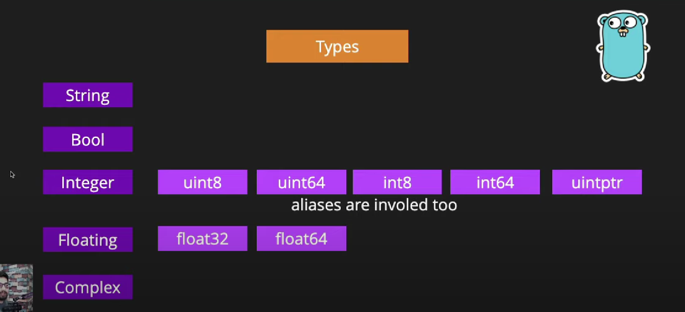
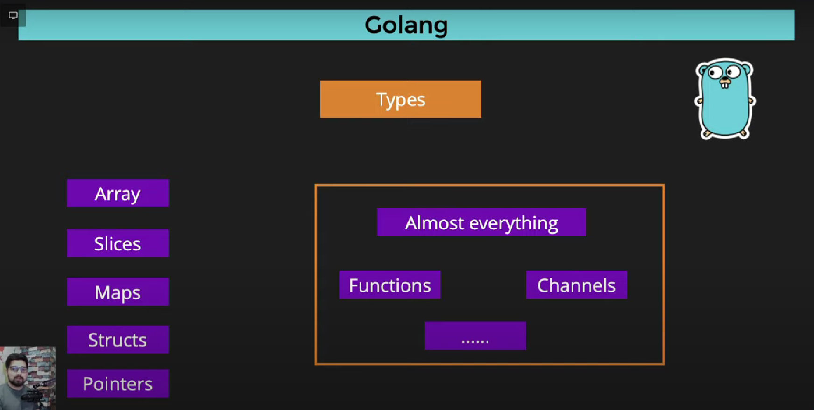

# GoLangStudy
Understanging Go Lang

Playlist reference
https://www.youtube.com/watch?v=62qGe9yhiJI&list=PLRAV69dS1uWQGDQoBYMZWKjzuhCaOnBpa&index=3

go help <command> - command to get help 

---

Whenever variable name starting is in caps it is a public variable
Datatype should be defined earlier
Everything is type

